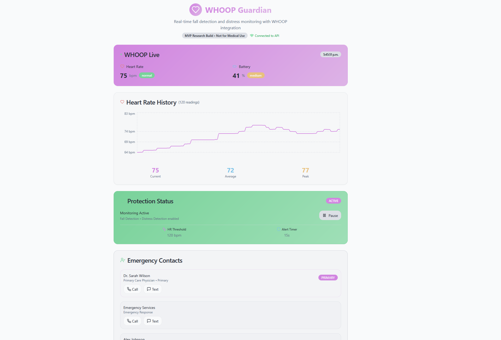
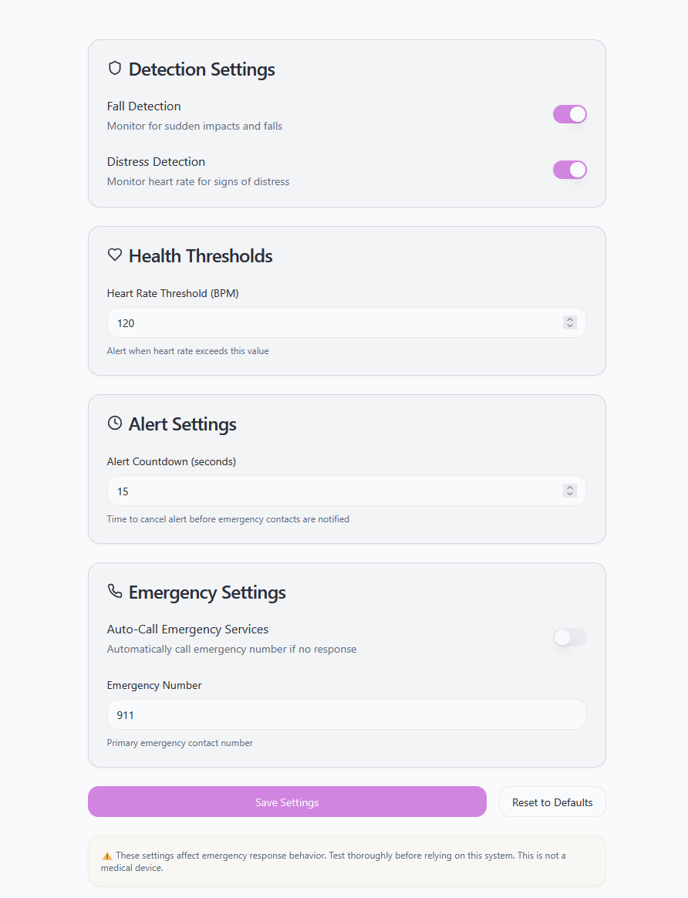

# Whoop-Osborn-Team
This is an MVP!
## Goal
To make a wearable tech software platform that could predict when Grandma Osborn is having a seizure or is in distress and send a message to family for help.
## Steps to Accomplish
1. Find a wearable device that can send the data required to achieve our goal
2. Verify that the wearable can send data
3. Create and algorithmic or machine learning approach to predict if Grandma is in distress and or having a seizure  
4. Collect sample data from Grandma to feed the algorithm
5. Create a UX experience on Grandma iPhone for easy calls for help or rejection of calls for help
6. Make a service that can warn family or persons of requirement
### Find a wearable device that can send the data required to achieve our goal
After look at the Oura ring, Apple watch and the Whoop. I found the Apple watch did have the battery lives and the existing apps were not great and pricy at 250$/year. The Oura ring and the Whoop both competed on battery life, but a decided to go for the wrist strap whoop instead of the ring, for wearability only as they both had developer tools.
### Verify that the wearable can send data
After testing using the bleak library in python I found that I was able to connect from the whoop from my pc and collect HR, RR data, and battery life. The next round of testing would be to use an IOS app to receive data, which I assume to be possible and won't be tested until the creation of the IOS app. We can use all of the functionality that the whoop app has without some of the extra features
## Functional Test UX
I built a simple website React Tailwind and then used a FastAPI to send the read data from the whoop to the front end for display.
## Visuals

